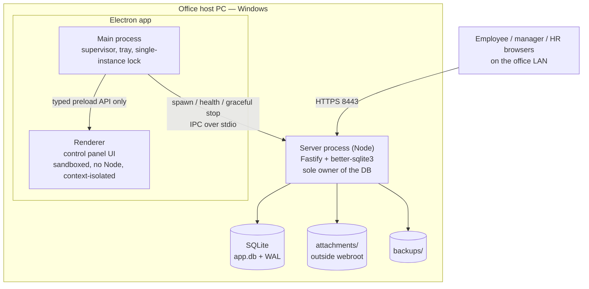
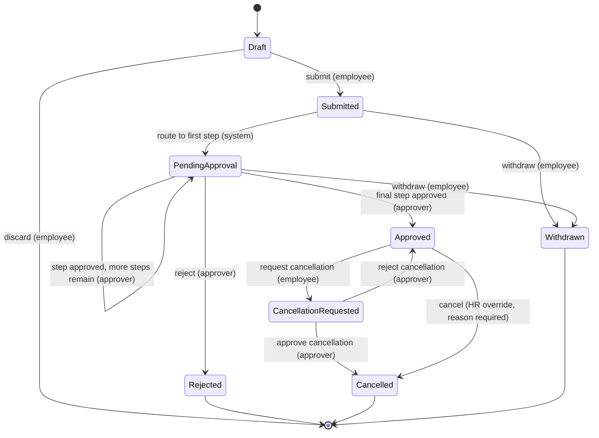

# Architecture

Planning document. Nothing described here is built yet.

---

## 1. Processes and boundaries

Three processes on one Windows machine. This separation is the most important
structural decision in the system: **the visible window is not the server.**



**Rules that follow from this diagram:**

- Only the server process ever opens the database. Not the Electron main process, not a
  backup script, not the operator.
- Closing the control panel window minimises to the tray. It does not stop the server.
- Stopping the server is an explicit action, with a warning, a graceful shutdown, and an
  extra confirmation when sessions are currently active.
- The renderer is sandboxed with context isolation and no Node integration. Its only
  capability is a narrow typed preload API — an explicit allowlist of commands, no
  generic IPC passthrough — under a strict CSP.
- The SQLite file lives on local disk. **Never** on a network share, and never reachable
  from an employee machine.

---

## 2. Repository layout

```
apps/
  web/          React + Vite. The employee/manager/HR/admin site.
  server/       Fastify API, static serving, scheduled jobs, migrations runner.
  desktop/      Electron control panel and server supervisor.
packages/
  domain/       Business rules. No SQLite, no Fastify, no React. Pure TypeScript.
  database/     Drizzle schema, migrations, repository implementations, seeds.
  auth/         Password hashing, sessions, CSRF, lockout, permission evaluation.
  contracts/    Zod schemas and shared types. Source of both validation and OpenAPI.
  ui/           Design tokens and reusable components.
  config/       Zod-validated configuration loading.
docs/
scripts/
```

**The dependency rule.** `domain` depends on nothing in this repo. `database` depends on
`domain` and `contracts`. `server` depends on all packages. `web` depends on `contracts`
and `ui` only. `desktop` depends on `config` only — it never imports the database layer.
Enforced by an ESLint boundary rule, not by good intentions.

**Why `domain` is storage-agnostic.** It defines repository _interfaces_; `database`
provides the SQLite implementation. Adding PostgreSQL later means adding an adapter, not
rewriting the rules. This is the only abstraction in the plan that exists before its
second implementation, and it is there because the brief explicitly requires a future
cloud path.

---

## 3. Ports and addresses

| Environment | What                | Address                           | Notes                                                                                  |
| ----------- | ------------------- | --------------------------------- | -------------------------------------------------------------------------------------- |
| Production  | Employee site + API | `https://<hostname>:8443`         | Bound to the configured LAN interface only, never `0.0.0.0` unless deliberately chosen |
| Production  | Health endpoint     | `https://<hostname>:8443/healthz` | No authentication, no data — liveness only                                             |
| Production  | Supervisor IPC      | stdio pipe                        | No TCP port. Nothing to attack.                                                        |
| Development | Vite dev server     | `http://localhost:5173`           | Proxies `/api` to the server                                                           |
| Development | Fastify             | `http://localhost:3000`           | HTTP in dev; HTTPS is exercised in a dedicated pre-release test                        |

Port and hostname are configurable at first run. A port conflict is detected at startup
and reported as a human-readable error with the occupying process named, not as a stack trace.

**Nothing about the network is finalised yet (D-17).** The responsible IT/network person has
not been identified, so the first-run wizard **must not require** a final hostname: it offers
running on the machine's current IP address for a pilot, or entering a hostname once one
exists, and either can be changed later without reinstalling. The firewall rule is proposed,
shown in full, and applied only with explicit consent. Tracked as DW-12.

---

## 4. Request path

```
Browser
  → TLS termination (Fastify, LAN certificate)
  → security headers + strict CSP
  → request-id assignment (echoed in every response and every log line)
  → rate limiter (strict on auth routes)
  → session cookie resolution → authenticated principal
  → CSRF check (non-GET only)
  → Zod schema validation of params, query, and body
  → route handler: thin. Translates HTTP to a use-case call.
  → USE-CASE  ← permission check happens HERE, with the principal and the target
  → domain rules (pure, testable, no I/O)
  → repository (parameterised SQL, inside one transaction)
  → response envelope
```

**Permission enforcement lives in the use-case, not the route.** A route that forgets its
guard fails a test; a use-case cannot be invoked without a principal because the principal
is a required argument of every use-case signature. Hidden buttons are a courtesy to the
user, never a control.

---

## 5. API conventions

Versioned under `/api/v1`. JSON only.

**Success**

```json
{ "data": {}, "meta": { "requestId": "01J...", "page": { "cursor": "...", "limit": 50 } } }
```

**Error** — one envelope, always.

```json
{
  "error": {
    "code": "LEAVE_INSUFFICIENT_BALANCE",
    "message": "Not enough casual leave for these dates.",
    "details": [{ "path": "endDate", "message": "Exceeds available balance by 1.5 days." }],
    "requestId": "01J..."
  }
}
```

- `code` is a stable machine string; `message` is human-readable and safe to display.
- Validation failures come from the same Zod schemas that generate the OpenAPI document.
- Pagination is cursor-based. Filter and sort fields are validated against an allowlist —
  a client cannot sort by `password_hash`.
- The OpenAPI document is generated from the `contracts` package, so it cannot drift.
- 401 (not authenticated) and 403 (authenticated, not permitted) are distinct, and a 403
  never reveals whether the target record exists.

---

## 6. Configuration

Loaded by `packages/config`, validated by Zod at startup. The process refuses to start on
an invalid configuration, with a message naming the offending key. Sources, in order:
built-in defaults → config file in the data folder → environment variables.

Secrets (certificate passphrase, optional SMTP password) are stored via a Windows
OS-protected mechanism (DPAPI), never in the config file, never in the repository.

Default data folder: `%PROGRAMDATA%\SimonAndSons\LeaveOS\` — chosen at first run,
containing `db\`, `attachments\`, `backups\`, `logs\`, `certs\`, `config.json`. Restrictive
ACLs are applied on creation, and verified by the health check.

---

## 7. Leave request state machine

The heart of the product. Every transition names its actor, its guard, its side effects,
and its audit event.



**Approver resolution (D-08/D-09).** Employee and Manager requests route to HR Officer;
HR requests route to Admin; Admin requests route to another Admin where one exists, and
otherwise to the requesting Admin as a labelled self-approval. Escalation to Admin is
automatic when no active HR account exists, when all HR accounts are disabled, when the
assigned HR approver is on approved leave covering the decision date, or when a configurable
SLA elapses. **Managers do not approve leave.** All of this is workflow _configuration_, not
branching in code — see [ADR 0009](adr/0009-approval-routing.md).

| Transition               | Actor                          | Guard                                                                                              | Ledger effect                                | Other effects                                                            |
| ------------------------ | ------------------------------ | -------------------------------------------------------------------------------------------------- | -------------------------------------------- | ------------------------------------------------------------------------ |
| submit                   | request owner                  | policy validated, balance sufficient, dates not in a locked period, attachment present if required | `PENDING_HOLD` (negative, reserved)          | audit, route to approval steps, notify approvers in-app **and by email** |
| approve step (not final) | current step approver          | step is current, actor is permitted, request version matches                                       | none                                         | audit, advance step, notify next approver                                |
| approve (final)          | final approver                 | as above                                                                                           | `PENDING_HOLD` released, `DEDUCTION` written | audit, notify employee, calendar updated                                 |
| reject                   | current step approver          | as above, reason required                                                                          | `PENDING_HOLD` released                      | audit, notify employee                                                   |
| withdraw                 | request owner                  | not yet finally approved                                                                           | `PENDING_HOLD` released                      | audit, notify approvers                                                  |
| request cancellation     | request owner                  | approved, and start date rule per policy                                                           | none                                         | audit, notify approver                                                   |
| approve cancellation     | approver                       | cancellation pending                                                                               | `CANCELLATION_CREDIT`                        | audit, notify employee, calendar updated                                 |
| HR cancel                | `leave.request.cancel:company` | reason required                                                                                    | `CANCELLATION_CREDIT`                        | audit with reason, notify employee and manager                           |

**Concurrency.** A decision is one transaction: read the request `FOR UPDATE`-equivalent
(SQLite: the write transaction serialises), assert the expected `version`, assert the state
transition is legal, write the ledger row, write the audit event, write the outbox row,
bump `version`, commit. A second approver arriving concurrently fails the version assertion
and receives "this request was already decided by <name>", not a double deduction.

**Idempotency.** Submit, approve, and import all accept an `Idempotency-Key`. The key,
its request hash, and its response are stored; a replay returns the original response
rather than acting twice.

---

## 8. Desktop control panel

**States:** `stopped`, `starting`, `running`, `degraded`, `backing-up`, `restoring`,
`migrating`, `error`. `degraded` means the server answers but a health check is failing —
low disk, a stale backup, or a failed outbox drain.

**Displays:** hostname, LAN URL, port, TLS state and certificate expiry, application
version, database schema version, uptime, active session count, last backup time and
result, next scheduled backup, free disk space.

**Actions:** Start · Stop · Restart · Open Admin Site · Copy Employee URL · Create Backup ·
Restore Backup · View Logs · Open Data Folder · Run Health Check · Export Support Bundle.

**Behaviour:**

- Single-instance lock. A second launch focuses the existing window.
- Tray icon; optional start-with-Windows.
- Closing the window minimises to tray. "Stop server and exit" is a separate, warned action,
  with an extra confirmation and an active-session count when sessions exist.
- Graceful shutdown: stop accepting new connections → let in-flight requests finish (bounded
  timeout, then abort) → roll back anything incomplete → WAL checkpoint → close the database →
  exit. Report each step in the UI.
- Crash detection with backoff (1s, 5s, 15s, 60s) and **a hard cap of 5 restarts in 10 minutes**,
  after which it stays down in `error` state and asks for a human. Never an infinite loop.
- Errors are shown as a plain sentence with a suggested action, plus a collapsed
  "technical details" section carrying the request id and stack.
- A permanent, visible notice: sleeping, shutting down, or disconnecting this computer makes
  the system unavailable to everyone.

**Support bundle** — versions, configuration with secrets redacted, recent logs, health
check output, migration status, disk and certificate state. No employee data, no database.

---

## 9. Scheduled work

Runs inside the server process, not the desktop. Every job is idempotent, records a run
record, and writes an audit event.

| Job           | Default                          | Purpose                                                                                                                                                             |
| ------------- | -------------------------------- | ------------------------------------------------------------------------------------------------------------------------------------------------------------------- |
| Backup        | nightly                          | SQLite online backup API, then verify by opening the copy and running an integrity check                                                                            |
| Accrual       | monthly, on the leave-year rule  | Writes `ACCRUAL` ledger entries                                                                                                                                     |
| Carry-forward | at the leave-year boundary       | Preview then commit; `CARRY_FORWARD` entries, cap applied                                                                                                           |
| Expiry        | at the carry-forward expiry date | `EXPIRY` entries                                                                                                                                                    |
| Outbox drain  | every minute                     | Sends queued email via the configured mailbox; retries with backoff, dead-letters after N attempts. A failure never affects the business transaction that queued it |
| Health check  | every 5 minutes                  | Disk, WAL size, backup freshness, certificate expiry, outbox depth                                                                                                  |
| Session sweep | hourly                           | Removes expired sessions                                                                                                                                            |

---

## 9a. Email notifications (D-13)

Sent through a **configured mailbox account** (company Google Workspace, Microsoft 365, or
similar), not a self-hosted mail server. Credentials via DPAPI. The only outbound connection
the server ever makes, and only when email is enabled.

**In-app notification and outbox row are written in the same transaction as the business
change.** The email is sent later by the drain job. If the provider is unreachable, nothing
about the request, the notification, or the approval is affected — this is what makes email
"for safety" rather than a dependency.

**The link in the email carries no authority.** It is an ordinary HTTPS URL to the request
page. Not signed in → login screen → then the request, with approve and decline available if
permissions allow. **No one-click approve from email**, no token, no magic link. Rationale in
[ADR 0010](adr/0010-email-deep-links.md).

Body content is minimal — requester, leave type, dates, working days, link. No reason text,
no attachments, no balances, nothing medical. Email leaves the building; the link does not.

Admin can preview exactly what the system sends before enabling it — the one genuinely good
idea kept from the prototype's email preview screen.

---

## 10. Local mode now, cloud mode later

The current deployment is local-only. To keep a cloud path open without pretending it
exists today:

- `domain` defines repository interfaces; `database` implements them for SQLite.
- No SQLite-specific type or SQL leaks above the repository layer.
- Migrations are written in portable SQL where practical, with any dialect divergence
  isolated in the adapter.
- Attachments go through a storage interface with a local-filesystem implementation.

**What a cloud mode would actually require** — stated plainly so nobody assumes it is a
switch: durable external PostgreSQL (not a local file), cloud object storage for
attachments, an external session store, a real certificate authority, a different backup
strategy, and a full re-run of the threat model. A writable local SQLite file cannot be
deployed to a serverless platform, and no part of this design pretends otherwise.

---

## 11. Technology choices, fixed

React + Vite · Fastify · better-sqlite3 + Drizzle · Zod · Electron + Electron Forge ·
TanStack Query for server state · Vitest · Playwright · one icon family (Lucide) ·
all fonts and assets bundled locally.

Client state beyond React's own: **none planned.** TanStack Query owns server state; URL
search params own filters and pagination so views are linkable and back/forward works. A
client-state library is added only if something concrete needs it, and the reason goes in
an ADR.
