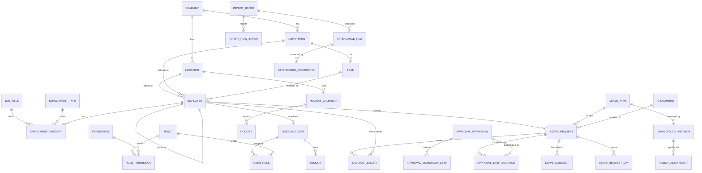

# Database schema

Planning document. Drizzle definitions and migrations are written in Milestone 1.

---

## 1. Conventions

| Rule           | Detail                                                                                                                                           |
| -------------- | ------------------------------------------------------------------------------------------------------------------------------------------------ |
| Identifiers    | ULID stored as `TEXT`. Sortable by creation time, no coordination, no guessable sequence. **Never `count + 1`.**                                 |
| Timestamps     | `TEXT` ISO-8601 UTC (`created_at`, `updated_at`).                                                                                                |
| Calendar dates | `TEXT` `YYYY-MM-DD`, no time, no zone. A leave day is a date, not an instant — this distinction prevents an entire class of off-by-one-day bugs. |
| Money / days   | `REAL` is banned. Leave day quantities are stored as `INTEGER` half-days (1 = 0.5 day) so half-day arithmetic is exact.                          |
| Booleans       | `INTEGER` 0/1 with a `CHECK`.                                                                                                                    |
| Enumerations   | `TEXT` with a `CHECK (col IN (...))` constraint. Enforced in the database, not only in Zod.                                                      |
| Soft delete    | Only where history demands it, via `archived_at`. Most records are never deleted.                                                                |
| Concurrency    | `version INTEGER NOT NULL DEFAULT 1` on records with contended writes (leave requests, employees, policies).                                     |
| Every table    | `created_at`, `created_by`, `updated_at`, `updated_by` unless it is append-only, in which case only `created_at` / `created_by`.                 |

**PRAGMAs set and verified at every startup** — startup fails loudly if any is not in effect:

```
PRAGMA foreign_keys = ON;
PRAGMA journal_mode = WAL;
PRAGMA synchronous = FULL;
PRAGMA busy_timeout = 5000;
```

`synchronous = FULL` rather than `NORMAL`: this host may lose power, and 50 users generate
nowhere near enough write volume for the cost to matter. Rationale in
[ADR 0003](adr/0003-sqlite-configuration.md).

---

## 2. Entity overview



---

## 3. Tables

### 3.1 Organisation

| Table             | Key columns                                                          | Notes                                                  |
| ----------------- | -------------------------------------------------------------------- | ------------------------------------------------------ |
| `company`         | `name`, `timezone`, `leave_year_start_month`, `leave_year_start_day` | Exactly one row, enforced by `CHECK (id = 'company')`. |
| `location`        | `name`, `code`, `timezone`, `holiday_calendar_id`, `archived_at`     | Unique `code`.                                         |
| `department`      | `name`, `code`, `head_employee_id`, `archived_at`                    | Unique `code`.                                         |
| `team`            | `department_id`, `name`, `lead_employee_id`, `archived_at`           | Unique `(department_id, name)`.                        |
| `job_title`       | `name`, `archived_at`                                                |                                                        |
| `employment_type` | `name`, `code`, `is_leave_eligible`                                  | e.g. permanent, probation, contract, intern.           |

### 3.2 People

| Table                | Key columns                                                                                                                                                                                                                             | Notes                                                                                                                                                                                                                                                                                                                                                                                                                                                                                              |
| -------------------- | --------------------------------------------------------------------------------------------------------------------------------------------------------------------------------------------------------------------------------------- | -------------------------------------------------------------------------------------------------------------------------------------------------------------------------------------------------------------------------------------------------------------------------------------------------------------------------------------------------------------------------------------------------------------------------------------------------------------------------------------------------- |
| `employee`           | `employee_code`, `first_name`, `last_name`, `work_email`, `status`, `joined_on`, `probation_end_on`, `exited_on`, `location_id`, `department_id`, `team_id`, `manager_employee_id`, `retention_class`, `retention_review_on`, `version` | `status IN ('active','probation','notice','exited','suspended')`. Unique `employee_code`, unique `work_email`. `manager_employee_id` self-FK; a cycle check runs on write. **Employees are deactivated, never deleted** (D-21): setting `status = 'exited'` disables the account and revokes every session in the same transaction. `retention_class` and `retention_review_on` are recorded from creation so a future policy can be applied without a migration — no deletion job exists (DW-08). |
| `employee_contact`   | `employee_id`, `personal_email`, `phone`, `address_*`                                                                                                                                                                                   | 1:1. Separated so contact detail can be permission-scoped independently of the directory.                                                                                                                                                                                                                                                                                                                                                                                                          |
| `emergency_contact`  | `employee_id`, `name`, `relationship`, `phone`, `is_primary`                                                                                                                                                                            | Many per employee.                                                                                                                                                                                                                                                                                                                                                                                                                                                                                 |
| `employment_history` | `employee_id`, `job_title_id`, `employment_type_id`, `department_id`, `manager_employee_id`, `effective_from`, `effective_to`, `reason`                                                                                                 | Append-oriented. `effective_to` NULL means current. `CHECK (effective_to IS NULL OR effective_to >= effective_from)`. No overlapping current rows — partial unique index on `(employee_id) WHERE effective_to IS NULL`.                                                                                                                                                                                                                                                                            |

### 3.3 Accounts and access

| Table              | Key columns                                                                                                                                                                                   | Notes                                                                                                                                                                  |
| ------------------ | --------------------------------------------------------------------------------------------------------------------------------------------------------------------------------------------- | ---------------------------------------------------------------------------------------------------------------------------------------------------------------------- |
| `user_account`     | `employee_id`, `email`, `password_hash`, `password_algo`, `must_change_password`, `is_disabled`, `disabled_reason`, `failed_attempts`, `locked_until`, `last_login_at`, `password_changed_at` | Unique `email`. `password_hash` is Argon2id. An account **may** exist without an employee (a break-glass administrator), and an employee may exist without an account. |
| `password_history` | `user_account_id`, `password_hash`, `created_at`                                                                                                                                              | Last N hashes, to block immediate reuse.                                                                                                                               |
| `session`          | `user_account_id`, `token_hash`, `issued_at`, `expires_at`, `last_seen_at`, `revoked_at`, `revoked_reason`, `ip`, `user_agent`                                                                | **Only the SHA-256 hash of the token is stored.** Unique `token_hash`.                                                                                                 |
| `login_attempt`    | `email_attempted`, `succeeded`, `ip`, `user_agent`, `created_at`, `failure_reason`                                                                                                            | Append-only. Never records the password or any part of it.                                                                                                             |
| `role`             | `code`, `name`, `is_system`                                                                                                                                                                   | System roles cannot be deleted, only extended.                                                                                                                         |
| `permission`       | `code`, `resource`, `action`, `scope`, `description`                                                                                                                                          | Seeded from a single canonical list. `code` = `resource.action:scope`.                                                                                                 |
| `role_permission`  | `role_id`, `permission_id`                                                                                                                                                                    | Composite PK.                                                                                                                                                          |
| `user_role`        | `user_account_id`, `role_id`, `granted_by`, `granted_at`                                                                                                                                      | Composite PK.                                                                                                                                                          |

### 3.4 Leave configuration

| Table                    | Key columns                                                                                                   | Notes                                                                                                                                                                                                                                                                                          |
| ------------------------ | ------------------------------------------------------------------------------------------------------------- | ---------------------------------------------------------------------------------------------------------------------------------------------------------------------------------------------------------------------------------------------------------------------------------------------- |
| `leave_type`             | `code`, `name`, `colour_token`, `is_paid`, `requires_attachment_rule`, `unit`, `archived_at`                  | `colour_token` names a design token, never a raw hex value.                                                                                                                                                                                                                                    |
| `leave_policy_version`   | `leave_type_id`, `version_no`, `effective_from`, `effective_to`, `rules_json`, `published_at`, `published_by` | `rules_json` is validated by a Zod schema and holds entitlement, accrual, carry-forward cap and expiry, probation restriction, half-day permission, minimum notice, maximum consecutive days, negative-balance allowance. **A published version is immutable.** Editing creates a new version. |
| `policy_assignment`      | `leave_policy_version_id`, `scope_type`, `scope_id`, `priority`                                               | `scope_type IN ('company','location','department','employment_type','employee')`. Highest priority wins; ties resolved by narrowest scope.                                                                                                                                                     |
| `holiday_calendar`       | `name`, `year`, `archived_at`                                                                                 |                                                                                                                                                                                                                                                                                                |
| `holiday`                | `holiday_calendar_id`, `date`, `name`, `kind`                                                                 | `kind IN ('public','optional','declared_working')`. Unique `(calendar_id, date, kind)`. `declared_working` turns a weekend into a working day, per the prototype's "declare a working day".                                                                                                    |
| `approval_workflow`      | `name`, `is_active`, `match_json`, `priority`                                                                 | `match_json` matches on department, leave type, duration band, employment type, location.                                                                                                                                                                                                      |
| `approval_workflow_step` | `workflow_id`, `step_no`, `approver_kind`, `approver_ref`, `is_optional`, `sla_hours`                         | `approver_kind IN ('reporting_manager','skip_level','department_head','role','specific_employee')`. Unique `(workflow_id, step_no)`.                                                                                                                                                           |

### 3.5 Leave transactions

| Table                    | Key columns                                                                                                                                                                                                                                                                 | Notes                                                                                                                                                                                                                                                                                                                                                                                                                |
| ------------------------ | --------------------------------------------------------------------------------------------------------------------------------------------------------------------------------------------------------------------------------------------------------------------------- | -------------------------------------------------------------------------------------------------------------------------------------------------------------------------------------------------------------------------------------------------------------------------------------------------------------------------------------------------------------------------------------------------------------------- |
| `leave_request`          | `employee_id`, `leave_type_id`, `policy_version_id`, `start_date`, `end_date`, `half_day_start`, `half_day_end`, `total_half_days`, `reason`, `status`, `workflow_id`, `current_step_no`, `submitted_at`, `decided_at`, `was_self_approved`, `escalation_reason`, `version` | `status` CHECK against the eight states. `was_self_approved` records an Admin approving their own request (D-08); `escalation_reason` records which of the four HR-absence conditions routed it to Admin — both are displayed, not merely stored. `policy_version_id` is captured at submission and **never** changes, so a later policy edit cannot rewrite this request's rules. `CHECK (end_date >= start_date)`. |
| `leave_request_day`      | `leave_request_id`, `date`, `portion`, `is_counted`, `skip_reason`                                                                                                                                                                                                          | One row per calendar day in the range. `portion IN ('full','am','pm')`. `is_counted = 0` for weekends and holidays, with `skip_reason` naming which — this is what powers the prototype's `calcSkipped` display, now as stored fact rather than a UI string. Unique `(leave_request_id, date)`.                                                                                                                      |
| `approval_step_instance` | `leave_request_id`, `step_no`, `approver_employee_id`, `status`, `decided_at`, `decision_note`, `delegated_from`                                                                                                                                                            | `status IN ('pending','approved','rejected','skipped','withdrawn')`. Unique `(leave_request_id, step_no)`. This is the approval trail.                                                                                                                                                                                                                                                                               |
| `leave_comment`          | `leave_request_id`, `author_user_id`, `body`, `visibility`, `created_at`                                                                                                                                                                                                    | `visibility IN ('all','approvers_only')`. Append-only.                                                                                                                                                                                                                                                                                                                                                               |
| `balance_ledger`         | see §5                                                                                                                                                                                                                                                                      | The core of the leave engine.                                                                                                                                                                                                                                                                                                                                                                                        |

### 3.6 Attendance

| Table                   | Key columns                                                                                                                                | Notes                                                                                                                                                                                                                                                                                                                                                                                                                                                                                                                                                          |
| ----------------------- | ------------------------------------------------------------------------------------------------------------------------------------------ | -------------------------------------------------------------------------------------------------------------------------------------------------------------------------------------------------------------------------------------------------------------------------------------------------------------------------------------------------------------------------------------------------------------------------------------------------------------------------------------------------------------------------------------------------------------- |
| `attendance_raw`        | `source`, `import_batch_id`, `employee_id`, `work_date`, `payload_json`, `source_row_no`, `source_hash`, `first_login_at`, `last_login_at` | **Immutable. Never updated, never deleted.** `source IN ('import','login')` (D-11). For `import`, `payload_json` preserves the source row verbatim including fields we do not yet understand. For `login`, the row is a **presence signal only** — first and last login timestamps for that date, unique on `(employee_id, work_date, source)`, with repeat logins extending `last_login_at` rather than creating rows. **A missing login row means nothing and must never be read as absence** — see [ADR 0011](adr/0011-login-derived-attendance.md), DW-31. |
| `attendance_correction` | `attendance_raw_id`, `field`, `old_value`, `new_value`, `reason`, `corrected_by`, `created_at`, `approved_by`, `approved_at`               | Append-only. The effective attendance value is raw + the ordered corrections.                                                                                                                                                                                                                                                                                                                                                                                                                                                                                  |

### 3.7 Files, imports, and system

| Table              | Key columns                                                                                                                                                                                                | Notes                                                                                                                                                                                                                                                                                                                         |
| ------------------ | ---------------------------------------------------------------------------------------------------------------------------------------------------------------------------------------------------------- | ----------------------------------------------------------------------------------------------------------------------------------------------------------------------------------------------------------------------------------------------------------------------------------------------------------------------------- |
| `attachment`       | `stored_name`, `original_name`, `mime_type`, `detected_type`, `size_bytes`, `sha256`, `owner_employee_id`, `entity_type`, `entity_id`, `classification`, `retention_until`, `uploaded_by`, `created_at`    | `stored_name` is generated and never derived from user input. `detected_type` comes from magic bytes; a mismatch with `mime_type` rejects the upload. `classification IN ('general','medical','payroll','identity')` and drives field-level access. Files live outside the webroot; downloads go through an authorised route. |
| `import_batch`     | `kind`, `status`, `original_filename`, `file_sha256`, `stored_file_path`, `row_count`, `ok_count`, `error_count`, `dry_run`, `idempotency_key`, `started_by`, `started_at`, `committed_at`, `summary_json` | `status IN ('uploaded','validating','preview_ready','committing','committed','failed','rolled_back')`.                                                                                                                                                                                                                        |
| `import_row_error` | `import_batch_id`, `row_no`, `column`, `code`, `message`, `raw_value`                                                                                                                                      | Row-level errors, shown in the preview.                                                                                                                                                                                                                                                                                       |
| `audit_event`      | `occurred_at`, `actor_user_id`, `actor_label`, `action`, `entity_type`, `entity_id`, `before_json`, `after_json`, `request_id`, `ip`, `user_agent`, `result`                                               | **Append-only.** No `UPDATE` and no `DELETE` grant; enforced additionally by triggers that raise on either. Sensitive values are redacted before write.                                                                                                                                                                       |
| `notification`     | `recipient_user_id`, `kind`, `title`, `body`, `entity_type`, `entity_id`, `read_at`, `created_at`                                                                                                          | In-app. Persistent.                                                                                                                                                                                                                                                                                                           |
| `outbox_message`   | `kind`, `payload_json`, `status`, `attempts`, `next_attempt_at`, `last_error`, `created_at`, `sent_at`                                                                                                     | Written inside the same transaction as the business change. Drained separately.                                                                                                                                                                                                                                               |
| `idempotency_key`  | `key`, `scope`, `request_hash`, `response_json`, `status`, `created_at`, `expires_at`                                                                                                                      | Unique `(scope, key)`. A replay with a different `request_hash` is a 409, not a silent success.                                                                                                                                                                                                                               |
| `backup_record`    | `path`, `started_at`, `finished_at`, `size_bytes`, `sha256`, `integrity_check_result`, `schema_version`, `trigger`, `status`                                                                               | A backup is not recorded as successful until it has been opened and integrity-checked.                                                                                                                                                                                                                                        |
| `app_setting`      | `key`, `value_json`, `updated_by`, `updated_at`                                                                                                                                                            | Non-secret runtime settings. Secrets never live here.                                                                                                                                                                                                                                                                         |
| `schema_migration` | managed by Drizzle                                                                                                                                                                                         | Applied migrations, with timestamps.                                                                                                                                                                                                                                                                                          |

---

## 4. Indexes

Beyond primary and unique keys:

```
leave_request        (employee_id, start_date)
leave_request        (status, current_step_no)
leave_request_day    (date) WHERE is_counted = 1     -- calendar and availability views
balance_ledger       (employee_id, leave_type_id, period_id)
approval_step_instance (approver_employee_id, status)
audit_event          (entity_type, entity_id, occurred_at)
audit_event          (actor_user_id, occurred_at)
session              (user_account_id) WHERE revoked_at IS NULL
notification         (recipient_user_id) WHERE read_at IS NULL
attendance_raw       (employee_id, work_date)
outbox_message       (status, next_attempt_at)
```

---

## 5. The balance ledger

**The rule: a balance is never stored. It is always `SUM(quantity_half_days)` over the ledger.**

```
balance_ledger
  id                  TEXT PK (ULID)
  employee_id         TEXT NOT NULL FK
  leave_type_id       TEXT NOT NULL FK
  period_id           TEXT NOT NULL FK  -- the leave year this entry belongs to
  entry_type          TEXT NOT NULL CHECK (entry_type IN (
                        'OPENING','ACCRUAL','ENTITLEMENT_GRANT','CARRY_FORWARD',
                        'PENDING_HOLD','HOLD_RELEASE','DEDUCTION','CANCELLATION_CREDIT',
                        'EXPIRY','ADJUSTMENT','ENCASHMENT','MIGRATION_OPENING'))
  quantity_half_days  INTEGER NOT NULL   -- signed. negative reduces the balance
  effective_on        TEXT NOT NULL      -- YYYY-MM-DD
  source_type         TEXT               -- 'leave_request' | 'job_run' | 'manual' | 'import'
  source_id           TEXT
  reason              TEXT               -- REQUIRED for ADJUSTMENT
  created_by          TEXT NOT NULL
  created_at          TEXT NOT NULL
  reverses_entry_id   TEXT NULL FK -> balance_ledger.id
```

**Properties:**

- **Append-only.** No `UPDATE`, no `DELETE`. A mistake is corrected by writing a reversing
  entry that points at the original via `reverses_entry_id`. History survives.
- **Exact arithmetic.** Half-days as integers. No floating point anywhere near a balance.
- `PENDING_HOLD` reserves days at submission so two requests cannot both spend the last
  two days. `HOLD_RELEASE` returns them on rejection or withdrawal. Final approval releases
  the hold and writes the `DEDUCTION`.
- Available balance = `SUM(quantity_half_days)` for the employee, type, and period. Pending
  holds are already negative, so the sum is the _truthful_ available figure, not an
  optimistic one.
- Every entry names its source, so any number on screen can be traced to the request, job
  run, or import that caused it. This is what makes "why is my balance 8.5?" answerable.
- `MIGRATION_OPENING` distinguishes balances imported from the old spreadsheets from
  balances this system computed. Reconciliation totals compare the two.
- **Performance:** at ~50 employees, roughly 8 leave types, and 20 entries per type per
  year, a full-year sum is a few thousand rows. Indexed, this is sub-millisecond. A cached
  balance table is not needed, would be a second source of truth, and is deliberately not built.

**Concurrency guarantee.** The submit and approve use-cases run inside a single SQLite
write transaction, which is serialised. Reading the current sum and writing the new entry
happen in the same transaction, so two concurrent submissions cannot both observe the same
remaining balance. This is tested explicitly — see [TESTING.md](TESTING.md) §5.

---

## 6. Retention (D-21)

**No record is ever deleted automatically.** The company's retention policy is not yet
written, and the instruction was explicit: do not silently assume indefinite legal retention.
So the system stores the _classifications and dates_ that a future policy will need, and
implements **no deletion job at all**. Enabling automated deletion, anonymisation, or
archival requires company and legal approval and is tracked as DW-08.

| Data                 | Behaviour in v1                                                                                                         | Note                                                                        |
| -------------------- | ----------------------------------------------------------------------------------------------------------------------- | --------------------------------------------------------------------------- |
| `audit_event`        | Retained, append-only                                                                                                   | Never purged. No UI path to delete.                                         |
| `balance_ledger`     | Retained, append-only                                                                                                   | Deleting it destroys the ability to explain any balance.                    |
| `session`            | Purged 30 days after expiry                                                                                             | Operational data, not employee data.                                        |
| `login_attempt`      | 180 days                                                                                                                | Security log.                                                               |
| `attendance_raw`     | Retained, immutable                                                                                                     | Both import and login sources.                                              |
| Attachments          | `retention_until` and `classification` recorded; no automatic deletion                                                  | Deletion is a deliberate, audited administrative action only.               |
| Backups              | 7 daily, 4 weekly, 12 monthly (D-20)                                                                                    | HR owns the weekly off-machine copy and the quarterly restore drill.        |
| **Exited employees** | **Deactivated, never deleted.** Account disabled and every session revoked in the same transaction as the status change | Access is restricted immediately. The record and its history remain intact. |

Every employee-scoped table carries `retention_class` and `retention_review_on` from
creation, so archival and anonymisation become possible later without a schema migration and
without a gap in the historical data.

---

## 7. Migrations

- Drizzle migrations, forward-only, each in its own file, applied in order, recorded in
  `schema_migration`.
- **Migrations run before the server accepts traffic.** A failed migration means the server
  does not start; it does not start half-migrated.
- A verified backup is taken immediately before any migration, automatically.
- Destructive migrations (dropping or narrowing a column) require an explicit
  acknowledgement flag and are called out in the release notes.
- Rollback boundary: rollback is by **restoring the pre-migration backup**, not by a down
  migration. Down migrations that claim to reverse data loss are a lie. This boundary is
  documented per release in `UPGRADE-AND-ROLLBACK.md`.
