# Implementation plan

Planning document, revised 2026-08-26 after all 21 decisions were answered.
**Approval of this package authorises M0 and M1 only.** Each later milestone has its own exit
criteria and its own go/no-go.

**Changes from the first draft, following the answers:**

- M2 gains the **Settings → Leave Rules** and **Leave Year** screens (D-04, D-03).
- M4's approval routing is now **HR-centred with Admin fallback and Admin self-approval**;
  managers no longer approve (D-08/D-09). The workflow engine is unchanged.
- M4 gains **email notification with authority-free deep links**, previously "optional,
  off by default" (D-13).
- M5 gains **login-derived attendance** as a signal source (D-11).
- M3 gains **bulk account provisioning with a one-time credential sheet** (D-15) and
  **employee deactivation with immediate access revocation** (D-21).
- M7's wizard must **not require a final hostname or certificate decision** (D-17, D-18).
- `docs/DEFERRED-WORK.md` and root `AGENTS.md` exist from M0 and are updated every milestone (D-05).

Net effect on effort: roughly +4 to +6 days, concentrated in M4 (email) and M5 (login
attendance). Managers no longer approving removes a little from M4 in exchange.

Effort is given in working days for one engineer, as a range. They are estimates, and the
estimate for M7 is the least reliable one because it depends on your machine, your network,
and your certificate decision.

---

## Milestone map

```mermaid
gantt
  dateFormat X
  axisFormat %s
  section Foundation
  M0 Skeleton            :m0, 0, 3
  M1 Vertical slice      :m1, after m0, 10
  section Phase 1
  M2 Leave engine        :m2, after m1, 12
  M3 People and org      :m3, after m1, 8
  M4 Approvals+calendar  :m4, after m2, 10
  M5 Attendance+import   :m5, after m3, 10
  M6 Reports+ops         :m6, after m4, 8
  section Release
  M7 Installer+docs      :m7, after m6, 12
  M8 Hardening+release   :m8, after m7, 8
```

M3 can run in parallel with M2 if there are two engineers. Everything else is sequential.

---

## M0 — Repository skeleton · 2–3 days

**Deliver:** pnpm workspace; TypeScript strict everywhere; ESLint with the dependency
boundary rule from ARCHITECTURE §2; Prettier; Vitest and Playwright configured; empty
package shells; CI running format, lint, typecheck, and test; `.env.example`; `README.md`
with a 10-minute developer start; `CHANGELOG.md`; the ADRs from this package committed;
`AGENTS.md` and `docs/DEFERRED-WORK.md` in place and referenced from the README (D-05).

**Note:** `pnpm` is not currently installed on this machine (Node 24.13.0 is). M0 installs it.

**Exit:** `pnpm install && pnpm check` passes from a clean clone. CI green. A deliberate
cross-boundary import (`domain` importing `database`) fails lint.

**Risk:** low. `better-sqlite3` native rebuild on Windows is the only thing that can bite,
and it is proven in M1 rather than assumed here.

---

## M1 — The vertical slice · 8–10 days

The most important milestone. It proves the architecture end to end before any feature
breadth is built.

**The slice:** install and start the server → first-run wizard creates the first
administrator → authenticate → create an employee → submit a leave request → approve it →
ledger and audit entries written → create a verified backup → stop the server → restart →
confirm everything persisted.

**Deliver:**

- `database`: initial migration with company, employee, user_account, session, role,
  permission, leave_type, leave_policy_version, leave_request, leave_request_day,
  balance_ledger, audit_event, idempotency_key. PRAGMAs set and verified at startup.
- `auth`: Argon2id (parameters calibrated on the target host and recorded in ADR 0005),
  sessions, CSRF, lockout, permission evaluation.
- `domain`: working-day calculation, the state machine, ledger arithmetic — with their tests.
- `server`: Fastify, health, security headers, request ids, error envelope, auth routes,
  employee create/read, leave submit/approve, backup endpoint, migration runner.
- `web`: shell, login, forced password change, employee home, apply form, approval queue.
  Tokens and the primitives those screens need. All nine states on those screens.
- `desktop`: Electron main supervising the server child process, tray, single-instance lock,
  start/stop/restart, status display, graceful shutdown, log view.
- Tests: unit for the engine, integration for the transaction boundary, one Playwright pass
  over the whole slice, plus F-01 (double approval) and F-03 (kill mid-write).

**Exit criteria:**

- [ ] The full slice runs on a developer machine, and the same slice runs from a packaged dev build
- [ ] Killing the server mid-write leaves no partial ledger entry (F-03)
- [ ] Two simultaneous approvals produce exactly one deduction (F-01)
- [ ] A backup is created, verified, and restored into an isolated directory (F-11)
- [ ] Closing the control panel window does **not** stop the server
- [ ] Screens work at 390px and 1280px
- [ ] `better-sqlite3` rebuilds and runs correctly inside the packaged Electron app

**Risks:** native module packaging under Electron Forge is the classic source of "works in
dev, fails in the installer" — which is exactly why it is proven here in M1 and not
discovered in M7. Argon2 parameter calibration needs the real host, so it may be provisional
until M7.

---

## M2 — Leave engine and the Rules page · 12–14 days

**Depends on:** M1. **D-04 is now answered:** HR configures the rules through the UI, so this
is no longer blocked — the deliverable is the editor, not the rules.

Leave types; versioned policies with effective dates and a published-is-immutable rule;
policy assignment resolution; **Settings → Leave Rules**, the HR/Admin editor for every policy
value with validation, an effective date, and a preview of who it affects; **Settings → Leave
Year** with the mid-year change guard (confirm, preview impact, auto-backup, audit);
**HR-managed holiday calendars** including optional/restricted holidays and declared working
days; accrual, carry-forward, and expiry jobs with preview-then-commit; probation rules;
half-days; balance ledger view; attachment upload with magic-byte validation and the
policy-driven requirement rule; cancellation and withdrawal flows.

**Exit:** every unit test in TESTING §2 passes. F-02 (concurrent balance) and F-21 (leave-year
change) pass. **HR can change every leave rule through the UI with no code change and no
migration.** Publishing a version does not alter any existing request. The ledger explains
every displayed balance, traceable to its source. Placeholder policies are visibly flagged as
placeholders everywhere they appear.

**Risk:** now largely retired. The residual risk is the Rules page being expressive enough for
rules we have not seen — mitigated by `rules_json` with a versioned Zod schema, so adding a
rule type later is additive.

---

## M3 — People and organisation · 6–8 days

Locations, departments, teams, job titles, employment types; the directory with scoped
visibility; employee profile with probation, joining date, and emergency contact;
employment history with effective dating and the no-overlap constraint; manager
reassignment and its handling of in-flight approvals; account management, admin-assisted
reset, session list and revoke, role assignment; the full RBAC matrix seeded.

Added by the answers: **bulk account provisioning** with generated temporary passwords and a
one-time credential sheet (D-15); **employee deactivation** with account disable and session
revocation in one transaction, and retention classifications recorded from creation (D-21).

**Exit:** every generated denial test from RBAC §3 passes, **including a Manager receiving 403
on approve** (F-18). Field-level payroll, medical, and identity restrictions verified on
serialised JSON. Manager reassignment leaves no orphaned approval step. F-23 (provisioning)
and F-24 (exit) pass. **No code path deletes an employee record.**

---

## M4 — Approvals, calendar, availability · 8–10 days

Configurable multi-step workflows; step instances and the approval trail; SLA ageing; the
month calendar (grid at ≥480px, agenda below); the team availability grid with its responsive
fallbacks; the overlap warning during application; the in-app notification centre.

**Configured per D-08/D-09:** HR approves employee and manager requests; Admin approves HR
requests and is the fallback; Admin self-approval permitted, separately permissioned,
labelled, and audited; the four HR-absence escalation conditions; **managers do not approve**.

**Email per D-13:** mailbox configuration with DPAPI-stored credentials, the outbox drain,
notification emails to HR/Admin on new requests, **authority-free deep links**, the
minimal-content body, the admin preview screen, and graceful degradation when the provider is
unreachable.

**Exit:** a three-step workflow routes, records, and completes correctly. Every illegal state
transition is rejected. F-16 to F-20 pass. **Killing the mail provider does not affect any
request, notification, or approval** (F-15). The calendar and grid are usable at all six
breakpoints. Notifications and outbox rows are written in the same transaction as the decision
that caused them.

---

## M5 — Attendance and Excel migration · 8–10 days

**Blocked on:** D-11 and D-14 for real-file validation; templates can be authored without them.

Attendance import with raw rows preserved immutably; **login-derived attendance signals**
(D-11) writing into the same raw model, with no absence inference and clear UI language about
what the data is and is not; the correction workflow with propose/approve; the effective-value
derivation; the migration flow for employees,
balances, historical requests, holidays, and attendance — template download, column
mapping, normalisation, duplicate detection, manager and department resolution, preview,
row-level errors, dry run, summary with reconciliation totals, idempotent commit inside one
transaction; the source file and its hash preserved.

**Exit:** F-05 (malformed workbook), F-12 (idempotent commit), and F-22 (login attendance)
pass. A dry run followed by a commit produces exactly the previewed result. Reconciliation
totals match. A partial import is impossible. **A failed attendance-signal write never fails a
login.**

---

## M6 — Reports, exports, operations · 6–8 days

Reports with charts **and** their equivalent data tables; server-side CSV and XLSX export
with permission checks, auditing, and formula-injection prefixes; the full-data export for
administrators; the audit log viewer with filters; health checks; log viewing; the support
bundle; scheduled backups with retention; the restore flow with its warnings; the migration
management screen.

**Exit:** every export is permission-checked and audited. The full-data export is produced,
opened, and reconciled. The health check correctly reports `degraded` for a stale backup,
low disk, and drifted ACLs.

---

## M7 — Installer and operator documentation · 10–12 days

**Still blocked on:** D-16 (host OS and hardware), D-17 (network owner), D-18 (certificate
environment). D-19 is resolved — unsigned for the pilot, with checksums. D-20 is resolved.

Electron Forge Windows installer with the native rebuild proven end to end; the first-run
wizard covering data folder, first administrator, company name / time zone / leave year,
port, Windows Firewall rule with consent, backup location and retention, sample-or-real data
import, first employee account, the second-computer test, the first verified backup, and
secure recording of the recovery information.

**The wizard must not force premature decisions** (D-17, D-18): hostname can be deferred in
favour of the machine's current IP for the pilot and changed later without reinstalling; the
certificate step offers "use our existing internal CA" or "create a private application CA",
asks which applies, and never suggests bypassing a warning. Both are changeable post-install.

Then the operator documentation, **written against the real installer while installing it**,
to the twelve-point beginner standard: `INSTALLATION-FOR-BEGINNERS`, `FIRST-RUN-WIZARD`,
`NETWORK-AND-HTTPS`, `BACKUP-AND-RESTORE`, `ADMIN-GUIDE`, `MANAGER-GUIDE`, `EMPLOYEE-GUIDE`,
`EXCEL-MIGRATION`, `UPGRADE-AND-ROLLBACK`, `TROUBLESHOOTING`, `OPERATIONS-RUNBOOK`,
`UNINSTALLATION`, plus `DEVELOPER-SETUP-WINDOWS` and `BUILD-AND-PACKAGE` for engineers.
Printable checklists, a real screenshot per installer and wizard screen, example values
visibly marked as examples, and a glossary.

**Exit:** a person who has never installed a server completes the installation from the
document alone, on a clean machine, with an observer recording where they hesitated. That
observation is the acceptance test for the documentation — not a review of it.

**Risk:** the highest-variance milestone. Certificate trust distribution across every client
machine is the specific step most likely to consume unplanned days.

---

## M8 — Hardening, verification, release · 6–8 days

The failure suite F-01 to F-14; the security pass against every threat in SECURITY §1; the
accessibility pass including manual keyboard and NVDA; the responsive pass at all six
breakpoints; performance with a synthetic 250-employee dataset and five years of history;
dependency and licence reports; the secret scan; the clean-machine install run; the LAN
HTTPS test from a second physical machine; the restore drill.

Then the **final verification report**, which separates:

1. Static review (read, not run)
2. Automated tests (run, with output)
3. Clean-machine installation (performed, by whom, on what, when)
4. Browser testing (which browsers, which viewports)
5. LAN testing (which machines, which network)
6. Security testing (what was actually attempted, and what was not)
7. Restore testing (which backup, restored where, what was compared)

Anything not performed is listed as **not verified**, with the reason. That list is part of
the deliverable, not an embarrassment to be minimised.

**Exit:** every gate in TESTING §7 is green with its evidence attached.

---

## Cross-cutting risks

| Risk                                                                 | Likelihood | Impact | Mitigation                                                                                                                                    |
| -------------------------------------------------------------------- | ---------- | ------ | --------------------------------------------------------------------------------------------------------------------------------------------- |
| HR never replaces the placeholder leave rules                        | Medium     | High   | Placeholders are visibly flagged everywhere they appear; replacing them is a go-live gate in the release checklist (DW-37)                    |
| Single Admin makes self-approval routine                             | Medium     | Medium | Standing self-approval report; recommendation on record to create a second Admin (DW-32)                                                      |
| Login attendance is read as a presence record by users               | Medium     | High   | Explicit UI language; no absence inference in v1; documented in the guides and in ADR 0011                                                    |
| Mail provider blocks the app (app-password requirements, throttling) | Medium     | Low    | Best-effort by design; setup docs cover Google Workspace and Microsoft 365 specifically; nothing depends on it                                |
| `better-sqlite3` fails inside the packaged app                       | Medium     | High   | Proven in M1, not M7. If it resists, `node:sqlite` (Node 24 built-in) is the fallback, with a documented adapter change                       |
| Certificate trust across every client machine                        | High       | Medium | Prefer an existing company CA (D-18); document per-client verification; budget extra days in M7                                               |
| The host machine sleeps or is shut down                              | High       | High   | Dedicated machine recommendation, sleep disabled, UPS, prominent in-app and documented warnings, and a browser state that explains it clearly |
| Excel files differ from expectation (D-14)                           | High       | Medium | Mapping UI rather than fixed columns; dry run; ask for anonymised samples early                                                               |
| Scope creep into Phase 2                                             | Medium     | Medium | PRODUCT-SCOPE is the boundary; Phase 2 items are designed for in the schema and built after Phase 1 is live                                   |
| Unsigned installer alarms users (D-19)                               | High       | Low    | Documented honestly with checksums; recommend buying a certificate                                                                            |

---

## Reporting at every milestone

Each milestone closes with: files created and changed · commands run · test results with
actual output · remaining risks · **claims that are not verified** · the next milestone and
what it needs.

---

## What I still need — and when

All 21 decisions are answered, so nothing blocks M0 through M4. These are needed later:

| Needed                                                                   | By      | If it does not arrive                                                                                               |
| ------------------------------------------------------------------------ | ------- | ------------------------------------------------------------------------------------------------------------------- |
| Anonymised Excel column headers and approximate row counts (D-14, DW-11) | M5      | The mapping UI is built anyway; validation against your real shapes is deferred and recorded as unverified          |
| Windows version and hardware of the host (D-16, DW-15/16)                | M7      | Argon2 parameters stay provisional; the clean-machine install test cannot be counted as passed                      |
| The responsible IT/network person (D-17, DW-12)                          | M7      | Pilot runs on the machine's IP; LAN HTTPS acceptance is deferred                                                    |
| Whether an internal CA or Windows domain exists (D-18, DW-13)            | M7      | The private application CA path is used, with per-client trust installation                                         |
| Mailbox credentials and provider (D-13, DW-34)                           | M4      | Email is built and left unconfigured; in-app notifications are unaffected                                           |
| A second Admin account (D-08, DW-32)                                     | Go-live | Self-approval becomes routine rather than a last resort                                                             |
| **Real leave rules entered by HR** (D-04, DW-37)                         | Go-live | **Blocks go-live.** The system runs on labelled placeholders and must not process real leave until HR replaces them |

**M0 can start now.**
